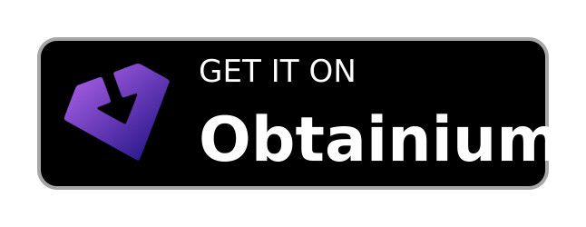
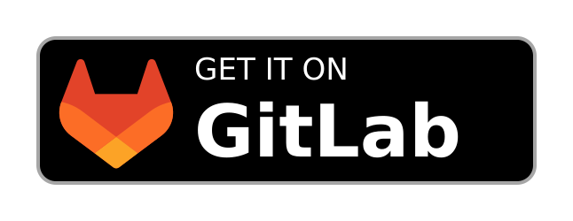

<div align="center">

# MeowClash

[](https://github.com/Loischsiy/MeowClash/releases/)
[](https://github.com/Loischsiy/MeowClash/releases/)
[](LICENSE)
[](#lataa)

[**English**](README.md) | **Suomi** | [**Русский**](README_RU.md) | [**Українська**](README_UK.md) | [**日本語**](README_JA.md) | [**简体中文**](README_ZH.md)

</div>

---

**MeowClash** on moderni, monipuolinen ja avoimen lähdekoodin usean käyttöjärjestelmän välityspalvelinasiakas, joka perustuu **ClashMeta (mihomo)** -ytimeen. Se tarjoaa tyylikkään Material You -käyttöliittymän välityspalvelinyhteyksien hallintaan, on täysin mainokseton ja toimii natiivisti Androidissa, Windowsissa, macOS:ssä ja Linuxissa.

*MeowClash on erinomaisen [FlClashX](https://github.com/pluralplay/FlClashX) -projektin haara.*

---

## 📸 Esikatselu

### Työpöytä
<div align="center">
  
</div>

### Mobiili
<div align="center">
  
</div>

---

## 🎨 Keskeiset ominaisuudet

### ✨ Käyttöliittymä ja ulkoasu (Material You)
- **Material 3 -käyttöliittymä**: Selkeä, moderni ja mukautuva Surfboardista inspiroitu käyttöliittymä.
- **Dynaamiset teemat**: Useita väriteemoja (TonalSpot, Fidelity, Monochrome, Neutral, Vibrant, Expressive, Content, Rainbow, FruitSalad), jotka tukevat tummaa, vaaleaa ja puhtaan mustaa tilaa.
- **Mukautuva välitys ja sarakkeet**: Säädä asettelun tiheyttä (tiivis, tavallinen, väljä) ja ruudukon sarakkeiden määrää (1–4) laitteesi näytön koon mukaan.
- **Responsiivinen asettelu**: Saumaton siirtyminen mobiili- ja työpöytäasettelujen välillä.

### ⚙️ Välityspalvelinydin (ClashMeta / mihomo)
- **Tehokas ydin**: Käyttää tehokasta Go-pohjaista `mihomo`-ydintä.
- **Lähtevän liikenteen tilat**: Tukee `Rule`-, `Global`- ja `Direct`-reititystä.
- **Reaaliaikaiset tilastot**: Dynaamiset verkon nopeuskaaviot (lähetys/lataus) ja kokonaisliikenteen seuranta.
- **Välityspalveluntarjoajan hallinta**: Lajittele välityspalvelinsolmut viiveen, nimen tai oletusasetusten mukaan.
- **Yhteyksien automaattinen sulkeminen**: Katkaise aktiiviset yhteydet automaattisesti vaihtaessasi välityspalvelinsolmua.
- **Välityspalvelinketjut (ketjutustila)**: Rakenna monivaiheisia ketjuja (sisääntulo → ulostulo), jotka reitittävät liikenteen usean välityspalvelimen kautta järjestyksessä `dialer-proxy`-asetuksella. Ota **ketjutustila** käyttöön suoraan Välityspalvelimet-sivulta, jotta kaikki liikenne kulkee valitun ketjun kautta tilaussääntöjen säilyessä ennallaan. Kun tila poistetaan käytöstä (tai kaikki ketjut poistetaan), sovellus palaa automaattisesti normaaliin tilaan.

### 🛡️ Verkko ja ytimen lisäasetukset
- **Järjestelmän välityspalvelin**: Ota järjestelmänlaajuiset välityspalvelinasetukset helposti käyttöön tai pois käytöstä Windowsissa ja macOS:ssä.
- **TUN-tila**: Reititä kaikki järjestelmätason verkkoliikenne virtuaalisen verkkosovittimen kautta (edellyttää järjestelmänvalvojan/root-oikeuksia).
- **Jaettu tunnelointi (käyttöoikeuksien hallinta)**: (Android) Lisää tietyt sovellukset sallittujen tai estettyjen listalle ja suodata järjestelmäsovellukset.
- **DNS-ohitus**: Mukauta nimipalvelimia, oletusnimipalvelimia, varapalvelimia ja välityspalvelimen nimipalvelimia sekä pakota DOH:n (DNS-over-HTTPS) HTTP/3-priorisointi.
- **Lähiverkkokäyttö (AllowLan)**: Salli muiden lähiverkon laitteiden muodostaa yhteys välityspalvelimesi kautta.
- **Ohitettavat toimialueet**: Määritä luettelo toimialueista, joiden tulee ohittaa järjestelmän välityspalvelin.
- **IPv6-tuki**: Ota IPv6-sisääntulevan liikenteen reititys kokonaan käyttöön tai pois käytöstä.
- **Vähän muistia käyttävä lataaja**: Ota Geo-tietokannoille käyttöön Go Low Memory -tila resurssien säästämiseksi.

### ☁️ Synkronointi, salaus ja palveluntarjoajaominaisuudet
- **WebDAV-synkronointi**: Varmuuskopioi ja palauta asetukset ja profiilit etäyhteyden kautta.
- **Salattujen tilausten purku**: Pura base64-koodattuja salattuja tilauksia (AES-256-CBC, avain johdetaan PBKDF2:lla) mukautettujen `meowclash-password`- ja `meowclash-password-iterations`-otsakkeiden avulla.
- **Mukautettujen otsakkeiden käsittely**:
  - `announce`: Näyttää käyttäjille mukautettuja ilmoituksia.
  - `support-url`: Tarjoaa suorat tukilinkit profiilin tietoihin.
  - `profile-update-interval`: Pakottaa tietyn tilauksen automaattisen päivitysvälin.
  - `x-hwid-limit`: Näyttää laiterajoitusvaroituksia omalla laitteistotunnuksen rekisteröintivalintaikkunallaan.

### 💻 Työpöytäintegrointi ja lisätyökalut
- **Pienennys ilmaisinalueelle**: Sovellus jatkaa hiljaa taustalla, kun pääikkuna suljetaan.
- **Automaattisen käynnistyksen asetukset**: Määritä automaattinen suoritus, automaattinen käynnistys (käynnistys järjestelmän käynnistyessä) ja hiljainen käynnistys (käynnistys piilotettuna).
- **Yleiset pikanäppäimet**: Sido näppäinoikoteitä ikkunan näyttämiseen/piilottamiseen, VPN:n käynnistämiseen/pysäyttämiseen, välityspalvelintilojen vaihtamiseen ja TUN-tilan hallintaan.
- **UWP Loopback Unlocker**: (Windows) Työkalu loopback-verkkoyhteyden helppoon käyttöönottoon Windows Store (UWP) -sovelluksille.
- **Lähetä televisioon (TV-synkronointi)**: Jaa määritysprofiileja helposti Android TV:lle tai älytelevisioille QR-koodin skannauksella tai verkkosiirrolla.
- **Diagnostiikkatyökalut**: Reaaliaikainen pyyntöjen katselu, yhteystietojen hallinta, yksityiskohtainen lokikonsoli vientitoiminnolla ja asetusten tyhjennysvaihtoehdot.

---

## 🔧 Käyttöjärjestelmäkohtaiset vaatimukset

### Linux
Varmista ennen sovelluksen käyttöä, että vaaditut järjestelmäkirjastot on asennettu:
```bash
# Ubuntu / Debian
sudo apt-get install libayatana-appindicator3-dev libkeybinder-3.0-dev

# Arch Linux
sudo pacman -S libayatana-appindicator libkeybinder3

# Fedora
sudo dnf install libayatana-appindicator-gtk3-devel keybinder3-devel

# Alpine
sudo apk add libayatana-appindicator-dev keybinder3-dev
```

### NixOS (Flake)

Jos käytät NixOS:ää, voit käyttää mukana toimitettua Flake-syötettä ja NixOS-moduulia.

Lisää syöte `flake.nix`-tiedostoosi:
```nix
{
  inputs = {
    nixpkgs.url = "github:nixos/nixpkgs/nixos-unstable";
    meowclash.url = "github:Loischsiy/MeowClash";
  };

  outputs = { self, nixpkgs, meowclash, ... }: {
    nixosConfigurations.your-hostname = nixpkgs.lib.nixosSystem {
      modules = [
        # Tuo moduuli
        meowclash.nixosModules.default
        ./configuration.nix
      ];
    };
  };
}
```

Määritä sen jälkeen ohjelma `configuration.nix`-tiedostossasi:
```nix
{
  # Ota ohjelma ja halutessasi TUN-tila käyttöön (luo ytimelle capability-kääreen)
  programs.meowclash = {
    enable = true;
    tunMode.enable = true; # Vaaditaan, jotta TUN-tila toimii ilman root-oikeuksia
  };
}
```

### Android
Tukee hallintaa kolmansien osapuolten automatisointityökaluilla (kuten Tasker) Intentien avulla:
- **Käynnistä VPN**: `com.meowclash.app.action.START`
- **Pysäytä VPN**: `com.meowclash.app.action.STOP`
- **Vaihda VPN**: `com.meowclash.app.action.TOGGLE`

---

## 📥 Lataa

Lataa uusimmat esikäännetyt binäärit julkaisusivuilta:

<a href="https://github.com/Loischsiy/MeowClash/releases">
  
</a>
<a href="obtainium://add/https://github.com/Loischsiy/MeowClash">
  
</a>
<a href="https://gitlab.com/Loischsiy/MeowClash/-/releases">
  
</a>

---

## 🛠️ Kääntäminen lähdekoodista

### Vaatimukset
1. Asenna **Flutter SDK (3.35.7)**.
2. Asenna **Golang (1.24.0)** (vaaditaan välityspalvelinytimen rakentamiseen).
3. Jos rakennat Windowsille: asenna **Rust** (uusin työkaluketju, Helper Serviceä varten), **GCC** ja **Inno Setup**.
4. Jos rakennat Androidille: asenna **Android SDK** ja **NDK** sekä määritä `ANDROID_NDK`-ympäristömuuttuja.

### Rakennusvaiheet
1. **Kloonaa tietovarasto ja aliprojektit:**
   ```bash
   git clone https://github.com/Loischsiy/MeowClash.git
   cd MeowClash
   git submodule update --init --recursive
   ```

2. **Nouda Flutter-paketit:**
   ```bash
   flutter pub get
   ```

3. **Luo koodi (mallit, providerit ja l10n):**
   ```bash
   dart run build_runner build --delete-conflicting-outputs
   flutter pub run intl_utils:generate
   ```

4. **Rakenna sovellus setup-apurilla:**

   - **Android:**
     ```bash
     dart setup.dart android
     ```
   - **Windows:**
     ```bash
     dart setup.dart windows --arch <arm64 | amd64>
     ```
   - **Linux:**
     ```bash
     dart setup.dart linux --arch <arm64 | amd64>
     ```
   - **macOS:**
     ```bash
     dart setup.dart macos --arch <arm64 | amd64>
     ```

---

## 🔄 Haaran tausta ja tärkeät muutokset

### Palveluntarjoajaohitusjärjestelmän uudistus (toukokuu 2026)
Mukautettu `meowclash-*`-ohitusjärjestelmä poistettiin kokonaan. Aiemmin nämä asetukset luettiin vain tilauksen HTTP-**vastausotsakkeista** (eikä profiilin YAML-rungosta), joten profiilien YAML-ohitukset eivät toimineet.

- **Säilytetty ja täysin toimiva**:
  - **Tilauksen salauksen purku**: Otsakkeet `meowclash-password` ja `meowclash-password-iterations` purkavat edelleen salatut base64-tilauskuormat natiivisti.
  - **Erityiset vastausotsakkeet**: `announce` (ilmoituspalkki), `support-url`, `profile-update-interval` (automaattisen päivitystiheyden hallinta) ja `x-hwid-limit` (laiterajoituksen valintaikkuna).
- **Poistetut asetukset (ovat nyt täysin käyttäjän hallittavissa asetuksissa)**:
  `meowclash-settings`, `meowclash-hex`, `meowclash-widgets`, `meowclash-view`, `meowclash-custom`, `meowclash-androidsecure`, `meowclash-servicename`, `meowclash-servicelogo`, `meowclash-serverinfo`, `meowclash-globalmode`, `meowclash-denywidgets`, `meowclash-background`. Käyttäjät hallitsevat nyt itse sovelluksen käynnistystapaa, tausta-asetuksia ja teemoja.

---

## 🤝 Kiitokset

- [FlClashX](https://github.com/pluralplay/FlClashX) — Alkuperäinen projekti, johon tämä sovellus perustuu.
- [mihomo (ClashMeta)](https://github.com/MetaCubeX/mihomo) — Tehokas välityspalvelinydin.
- Kaikki sovelluksen testaamiseen ja kääntämiseen osallistuneet.

## 📄 Lisenssi
MeowClash on avoimen lähdekoodin ohjelmisto ja julkaistu [GPL-3.0-lisenssillä](LICENSE).
